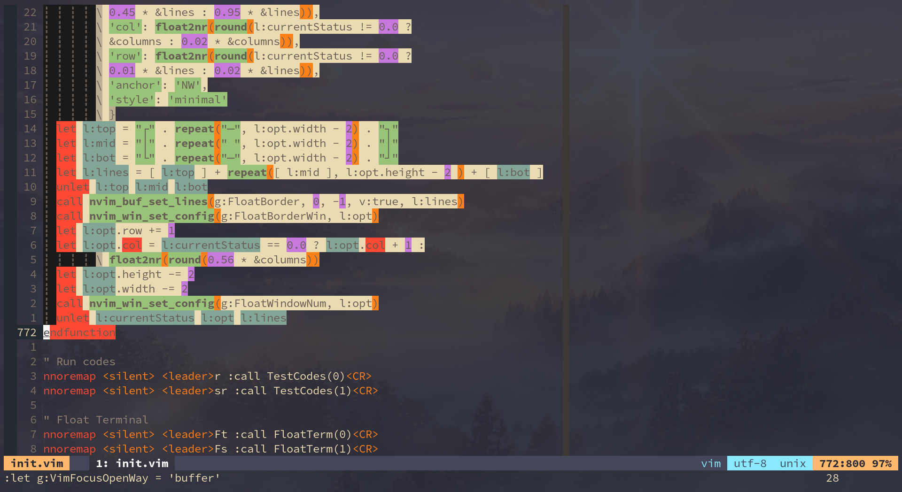
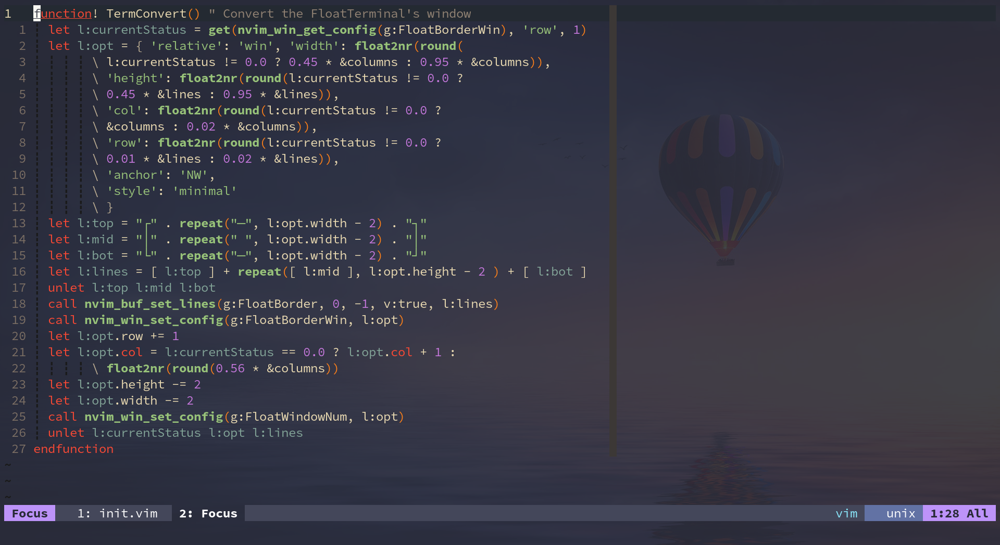
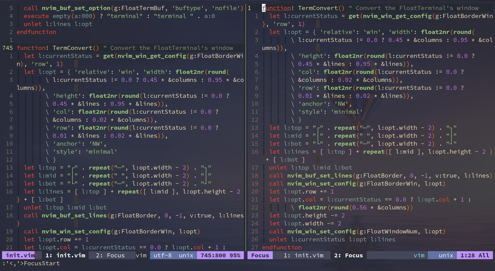

## Vim-Focus

This is a plugin that can make you focus on the fragments in vim.(Inspired by Emacs)  
Maybe you can't understand what it means.You can look the after example:







### Installation

To install it with [vim-plug](https://github.com/junegunn/vim-plug) :

```vim
Plug 'SpringHan/vim-focus'
```

### Usage

#### Configuration

```vim
" These are the keybindings of the commands:
vnoremap <silent> <leader>vf :FocusStart<CR>
nnoremap <silent> <leader>vs :FocusConvert<CR>
nnoremap <silent> <leader>vS :FocusSave<CR>

" This is the open way of the focus buffer.Default is 'buffer', or it can be 'window'
let g:VimFocusOpenWay = 'window'
```

#### Commands

- `:FocusStart` : When you have selected the fragments needs to focus, you can use this command to get in the focus buffer.

- `:FocusConvert` : When you finished the fragments' modifies, you can use this command to convert the focus buffer back to the origin file.

- `:FocusSave` : While you editing in the focus buffer, you can use this command to save the modifies to the original buffer without closing the focus buffer.

### License

MIT
